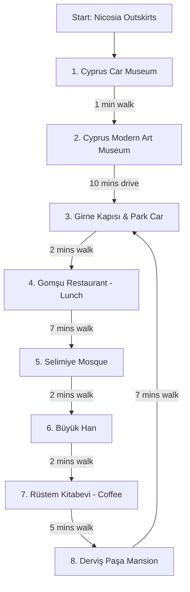
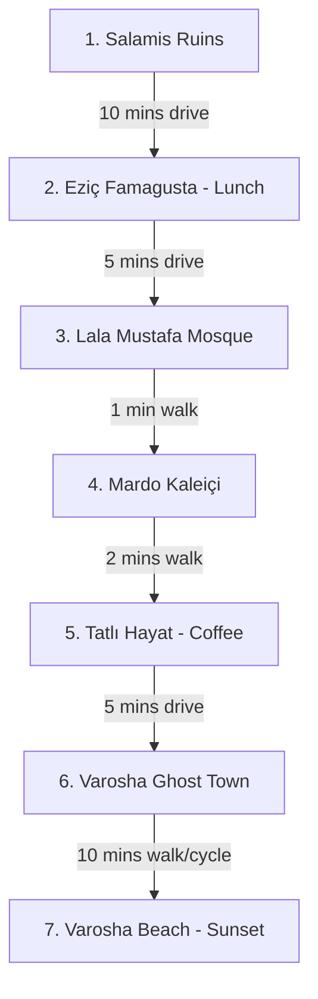
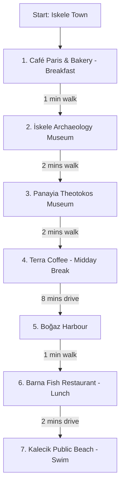

# Drive KKTC — The Best Itineraries Guide 🚗
*A Premium Road-Trip Guide for Scenic Driving Routes in Northern Cyprus*

This guide analyzes all five driving routes across Northern Cyprus to establish the most efficient, logical, and geographically optimized routes. By restructuring the sequence of stops, we eliminate unnecessary backtracking, optimize for the sun and venue hours, and ensure a natural, editorial flow that reads like a premium travel magazine.

---

## Quick Navigation
1. [Nicosia Walled City Historic Loop](#1-nicosia-walled-city-historic-loop)
2. [Kyrenia Coast & Medieval Castles Route](#2-kyrenia-coast--medieval-castles-route)
3. [Famagusta Walled City & Ancient Salamis Route](#3-famagusta-walled-city--ancient-salamis-route)
4. [Iskele & Karpaz Peninsula Wild Journey](#4-iskele--karpaz-peninsula-wild-journey)
5. [Lefke & Güzelyurt Citrus Valleys Route](#5-lefke--güzelyurt-citrus-valleys-route)

---

## 1. Nicosia Walled City Historic Loop
* **Theme**: The Walking & Walled City Culture Loop
* **Optimal Flow**: NEU Campus (Outskirts) &rarr; Walled City North Gate (Park) &rarr; Historic Walking Loop

### Recommended Stop Order
1. **Cyprus Car Museum** (Near East University Campus)
2. **Cyprus Modern Art Museum** (Near East University Campus)
3. **Girne Kapısı (Kyrenia Gate)** (Walled City Entrance)
4. **Gomşu Restaurant** (Inside Walled City)
5. **Selimiye Mosque (St. Sophia Cathedral)** (Inside Walled City)
6. **Büyük Han (Great Inn)** (Inside Walled City)
7. **Rüstem Kitabevi** (Inside Walled City)
8. **Derviş Paşa Mansion Museum** (Inside Walled City)

### Why Start Here?
* **First Location**: **Cyprus Car Museum**
* **Rationale**: The Near East University campus lies just off the main northern highway. Visiting the two university museums first avoids driving into the heavily congested old city center twice. Crucially, these museums close strictly at 17:00, so doing them first ensures you won't run out of time. Once finished, you drive to the walled city, park your car once, and complete the rest of the tour on foot.

### Estimated Drive / Walk Times
* **NEU Highway Entrance &rarr; Cyprus Car Museum**: 5 mins drive
* **Cyprus Car Museum &rarr; Cyprus Modern Art Museum**: 1 min walk (adjacent buildings)
* **Cyprus Modern Art Museum &rarr; Kyrenia Gate Parking**: 10 mins drive (6.5 km)
* **Kyrenia Gate &rarr; Gomşu Restaurant**: 2 mins walk (150 m)
* **Gomşu Restaurant &rarr; Selimiye Mosque**: 7 mins walk (550 m)
* **Selimiye Mosque &rarr; Büyük Han**: 2 mins walk (200 m)
* **Büyük Han &rarr; Rüstem Kitabevi**: 2 mins walk (180 m)
* **Rüstem Kitabevi &rarr; Derviş Paşa Mansion Museum**: 5 mins walk (400 m)
* **Derviş Paşa Mansion &rarr; Kyrenia Gate (Return to Car)**: 7 mins walk (600 m)

> [!IMPORTANT]
> **Driving inside Walled Nicosia is strongly discouraged.** The streets are extremely narrow, single-lane, and feature complex one-way grids. Park in the open municipal lot just outside **Kyrenia Gate** and enjoy the city as it was built to be experienced: on foot.

---

## 2. Kyrenia Coast & Medieval Castles Route
* **Theme**: Mountains to the Sea
* **Optimal Flow**: Far West &rarr; Mountain Peaks &rarr; Coastal Cooldown &rarr; East Hills Sunset

### Recommended Stop Order
1. **Mavi Köşk (The Blue House)** (Far West / Kozan)
2. **St. Hilarion Castle** (Kyrenia Mountain Ridge)
3. **Kyrenia Tandem Paragliding** (Beşparmak Mountains / Harbor)
4. **Ulfet Beach Club** (Karaoğlanoğlu Coast)
5. **Vola Coffee** (Kyrenia Town Center)
6. **Bellapais Abbey** (East Hills)
7. **Kybele Restaurant** (Bellapais Abbey Grounds)

### Why Start Here?
* **First Location**: **Mavi Köşk (The Blue House)**
* **Rationale**: Located ~30 km west of Kyrenia. Starting early in the morning (opens 09:00) allows you to complete this fascinating tour before the midday tourist buses arrive. Because it is located inside a military zone, passport/ID checks at the gate are faster and smoother in the morning. After this, you move steadily east, transitioning naturally from mountain peak history to coastal relaxation.

### Estimated Drive Times
* **Mavi Köşk &rarr; St. Hilarion Castle**: 30 mins (25 km)
* **St. Hilarion Castle &rarr; Paragliding Take-off**: 5 mins (3 km)
* **Paragliding Landing Area &rarr; Ulfet Beach Club**: 10 mins (5 km)
* **Ulfet Beach Club &rarr; Vola Coffee (Center)**: 10 mins (5 km)
* **Vola Coffee &rarr; Bellapais Abbey**: 15 mins (6 km climbing inland)
* **Bellapais Abbey &rarr; Kybele Restaurant**: 0 mins (located inside the Abbey grounds)

> [!TIP]
> **Bellapais Abbey** is best experienced during the late afternoon "golden hour." The warm sunlight hitting the gothic arches provides spectacular views over the Kyrenia coastline. Follow this immediately with dinner at **Kybele Restaurant** as the ruins light up for the evening.

---

## 3. Famagusta Walled City & Ancient Salamis Route
* **Theme**: Ancient Ruins to Ghost Town Sunset
* **Optimal Flow**: North Ruins &rarr; Modern Lunch &rarr; Walled City Walking Loop &rarr; South Ghost Town & Beach

### Recommended Stop Order
1. **Salamis Harabeleri (Salamis Ruins)** (North of Famagusta)
2. **Eziç Famagusta** (New Famagusta)
3. **Lala Mustafa Paşa Mosque (St. Nicholas Cathedral)** (Old Walled City)
4. **Mardo Kaleiçi** (Old Walled City)
5. **Tatlı Hayat** (Old Walled City)
6. **Kapalı Maraş (Varosha)** (South Walled City)
7. **Varosha Beach** (Varosha Zone Coastline)

### Why Start Here?
* **First Location**: **Salamis Ruins**
* **Rationale**: Salamis is a sprawling, completely open archaeological site with almost no shade. Starting at 09:00 is essential to avoid the intense Mediterranean midday heat. After touring the ancient Roman gymnasium and theater, you drive south to enjoy lunch, visit the medieval walled city, and finish the day at Varosha.

### Estimated Drive Times
* **Salamis Ruins &rarr; Eziç Famagusta**: 10 mins (8 km)
* **Eziç Famagusta &rarr; Walled City (Lala Mustafa)**: 5 mins (2 km)
* **Inside Walled City Walk (Lala Mustafa &rarr; Mardo &rarr; Tatlı Hayat)**: 2-3 mins walking loop
* **Walled City &rarr; Varosha (Kapalı Maraş) Entrance**: 5 mins (2 km)
* **Varosha Entrance &rarr; Varosha Beach**: 10 mins walk or bicycle ride (pedestrian-only zone)

> [!NOTE]
> Rent a bicycle at the entrance of **Varosha**. The paved paths through the abandoned city extend for several kilometers, making a bike the most efficient and enjoyable way to explore the ghost town and reach the beach.

---

## 4. Iskele & Karpaz Peninsula Wild Journey
* **Theme**: The Coastal Gateway
* **Optimal Flow**: Iskele Walled Center Loop &rarr; Scenic Northeast Coast Drive &rarr; Seaside Cooldown

### Recommended Stop Order
1. **Café Paris & Bakery** (Iskele Walled Center)
2. **İskele Archaeology Museum** (Iskele Walled Center)
3. **Panayia Theotokos Icon Museum** (Iskele Walled Center)
4. **Terra Coffee & Lounge** (Iskele Walled Center)
5. **Boğaz Harbour** (Coastal Fishing Village)
6. **Barna Beach Fish Restaurant** (Boğaz Quayside)
7. **Kalecik Public Beach** (Kalecik Coast)

### Why Start Here?
* **First Location**: **Café Paris & Bakery**
* **Rationale**: Iskele serves as the gateway to the wild Karpaz Peninsula. Starting at Café Paris provides a premium European-style breakfast and coffee to plan your driving route. Since the first four stops are clustered tightly within Iskele's town center, you can park once, walk the loop, and then head northeast along the coastal highway toward Boğaz.

### Estimated Drive Times
* **Inside Iskele Center Walk (Café Paris &rarr; Museum &rarr; Church &rarr; Terra Coffee)**: 5 mins walking loop
* **Iskele Center &rarr; Boğaz Harbour**: 8 mins (7 km drive northeast)
* **Boğaz Harbour &rarr; Barna Beach Fish Restaurant**: 1 min walk (adjacent to harbor quay)
* **Barna Beach Fish Restaurant &rarr; Kalecik Public Beach**: 2 mins drive (1.5 km northeast)

---

## 5. Lefke & Güzelyurt Citrus Valleys Route
* **Theme**: Reservoirs, Ancient Ruins, and Strawberry Fields
* **Optimal Flow**: Valley Entrance Lake &rarr; Mining History &rarr; Coastal Cliffs &rarr; West Border Sunset

### Recommended Stop Order
1. **Gemikonağı Göleti (Gemikonağı Dam)** (Gemikonağı Hills)
2. **Lefke Mining Museum** (Lefke Center)
3. **MOAR Cafe** (Lefke Center)
4. **Cengiz Topel Monument** (Coastal Highway West)
5. **Vouni Palace** (Ancient Hilltop Palace)
6. **Yeşilırmak Beach** (West Coast Border)
7. **Dillirga Restaurant** (Yeşilırmak Coast)

```mermaid
graph LR
    A[1. Gemikonağı Dam] -->|8 mins drive| B[2. Lefke Mining Museum]
    B -->|1 min walk| C[3. MOAR Cafe]
    C -->|8 mins drive| D[4. Cengiz Topel Monument]
    D -->|12 mins drive| E[5. Vouni Palace]
    E -->|15 mins drive| F[6. Yeşilırmak Beach]
    F -->|1 min walk| G[7. Dillirga Restaurant]
```

### Why Start Here?
* **First Location**: **Gemikonağı Göleti (Gemikonağı Dam)**
* **Rationale**: Located just off the main road entering the Lefke region from Güzelyurt. Visiting early in the morning offers calm, glass-like water reflecting the surrounding green hills—perfect for morning photography. This starts a logical, linear East-to-West route along the western coastline.

### Estimated Drive Times
* **Gemikonağı Dam &rarr; Lefke Mining Museum**: 8 mins (5 km drive south into the valley)
* **Lefke Mining Museum &rarr; MOAR Cafe**: 1 min walk (adjacent in Lefke center)
* **MOAR Cafe &rarr; Cengiz Topel Monument**: 8 mins (5.5 km drive north/west to the coast)
* **Cengiz Topel Monument &rarr; Vouni Palace**: 12 mins (8 km drive climbing into the cliffs)
* **Vouni Palace &rarr; Yeşilırmak Beach**: 15 mins (10 km descending back to the coastal highway heading west)
* **Yeşilırmak Beach &rarr; Dillirga Restaurant**: 1 min walk (adjacent beachfront)

> [!TIP]
> End this itinerary in **Yeşilırmak** (the westernmost village in Northern Cyprus). It is famous for its sunset views. Enjoying fresh local fish and meze under the grapevines at **Dillirga Restaurant** as the sun dips below the western sea is the perfect ending to the day.

---

## Route Summaries Table

| Route Name | Starting Point | Ending Point | Stops Count | Total Est. Drive Time | Difficulty | Key Theme |
| :--- | :--- | :--- | :--- | :--- | :--- | :--- |
| **Nicosia Historic Loop** | Cyprus Car Museum | Derviş Paşa Mansion | 8 | 15 mins (Driving) + Walking Loop | Easy | Urban Walking & Culture |
| **Kyrenia Coast & Castles** | Mavi Köşk | Kybele Restaurant | 7 | 1 hr 20 mins | Medium | Peaks, Flying & Fine Dining |
| **Famagusta & Salamis** | Salamis Ruins | Varosha Beach | 7 | 30 mins | Easy | Roman Ruins to Ghost Town |
| **Iskele & Karpaz Gateway** | Café Paris & Bakery | Kalecik Beach | 7 | 10 mins (Driving) + Walking Loop | Medium | Gateway Coastal Escape |
| **Lefke & Citrus Valleys** | Gemikonağı Dam | Dillirga Restaurant | 7 | 45 mins | Medium | Orchards, Cliffs & Border Sunset |
